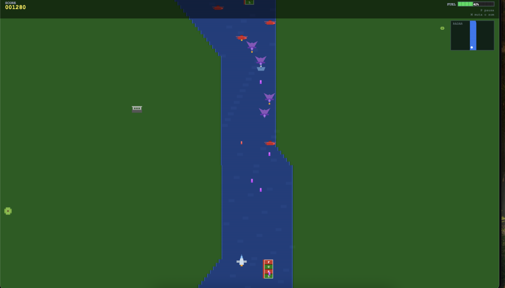

# River Raid

Clone moderno de River Raid para navegador, construído com `React + Vite + TypeScript + HTML5 Canvas`.

O projeto usa uma arquitetura com shell React e engine modular em TypeScript puro dentro de `src/game/`, mantendo o loop principal e a lógica de gameplay fora do ciclo de render do React.

## Preview



## Jogue online

- GitHub Pages: https://brunolagoa.github.io/river-raid/

## Demo do jogo

- Scroll vertical contínuo
- Movimento horizontal dentro do rio
- Tiro, combustível, score e game over
- Inimigos variados e dificuldade progressiva
- HUD no canvas, ranking local e efeitos visuais/sonoros

## Stack

- React 19
- Vite 8
- TypeScript 6
- Canvas 2D API
- Web Audio API
- ESLint

## Como rodar

### Pré-requisitos

- Node.js 20+
- npm

### Instalação

```bash
npm install
```

### Desenvolvimento

```bash
npm run dev
```

### Build de produção

```bash
npm run build
```

### Preview local

```bash
npm run preview
```

### Lint

```bash
npm run lint
```

### Typecheck

```bash
npx tsc -b
```

## Controles

- `←` / `→`: mover avião
- `Space`: atirar
- `P` ou `Esc`: pausar
- `M`: mutar som
- `Enter`: iniciar / reiniciar

## Features implementadas

- Mundo procedural com rio que varia largura e direção
- 4 tipos de inimigos:
  - helicópteros
  - aviões
  - barcos
  - pontes
- Sistema de combustível com coleta de tanques
- Colisão AABB para player, inimigos, tiros e pickups
- Score em tempo real
- High score persistido em `localStorage`
- Ranking top 10 com input inline de nome
- HUD com score, combustível, mute, pause e minimap
- Efeitos visuais:
  - partículas
  - explosões
  - score popups
  - flash de tela
- Cenário com objetos decorativos nas margens:
  - palmeiras
  - árvores
  - casas
  - arbustos
  - rochas
  - tanques decorativos
- Sons procedurais:
  - tiro
  - explosão
  - coleta de combustível
  - hit em inimigo
  - game over
  - trilha chiptune retrô discreta

## Estrutura do projeto

```text
src/
  game/
    Game.ts
    Player.ts
    EnemyManager.ts
    World.ts
    FuelSystem.ts
    CollisionSystem.ts
    Fx.ts
    Scenery.ts
    SoundManager.ts
    UI.ts
  components/
    GameCanvas.tsx
  App.tsx
  main.tsx
```

## Arquitetura

### Princípio central

- React renderiza apenas shell, menus e tela de game over
- Canvas renderiza o gameplay
- `Game.ts` orquestra todos os sistemas
- Cada sistema vive em um módulo isolado em `src/game/`

### Fluxo

```text
App.tsx
  -> GameCanvas.tsx
    -> Game.ts
      -> World.ts
      -> Player.ts
      -> EnemyManager.ts
      -> FuelSystem.ts
      -> CollisionSystem.ts
      -> Fx.ts
      -> Scenery.ts
      -> UI.ts
      -> SoundManager.ts
```

## Persistência local

O projeto usa `localStorage` para salvar:

- high score
- ranking top 10

## Estado atual

O jogo está funcional e jogável, com fases centrais concluídas e parte do polimento já implementada.

Roadmap e ideias futuras estão documentados em `spec.md`.

## Notas técnicas

- Canvas-only para gameplay
- Sem engine externa de jogos
- Tipagem strict com TypeScript
- Foco em manter 60 FPS e evitar custo desnecessário no hot loop

## Referências internas

- `introducion.md`: especificação canônica do jogo
- `prd.md`: visão de produto e fases
- `spec.md`: roadmap de evolução
- `AGENTS.md`: regras de arquitetura e operação do repositório
